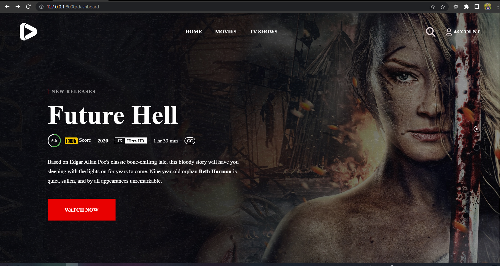
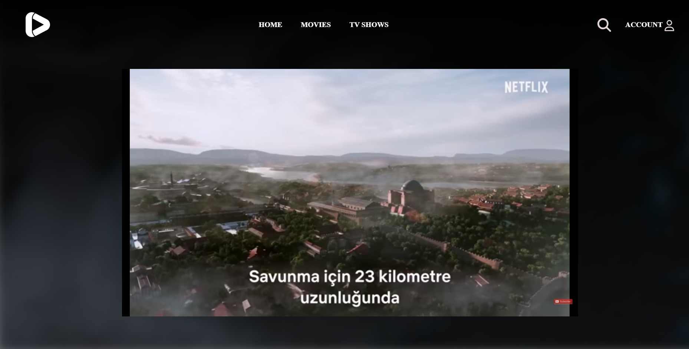
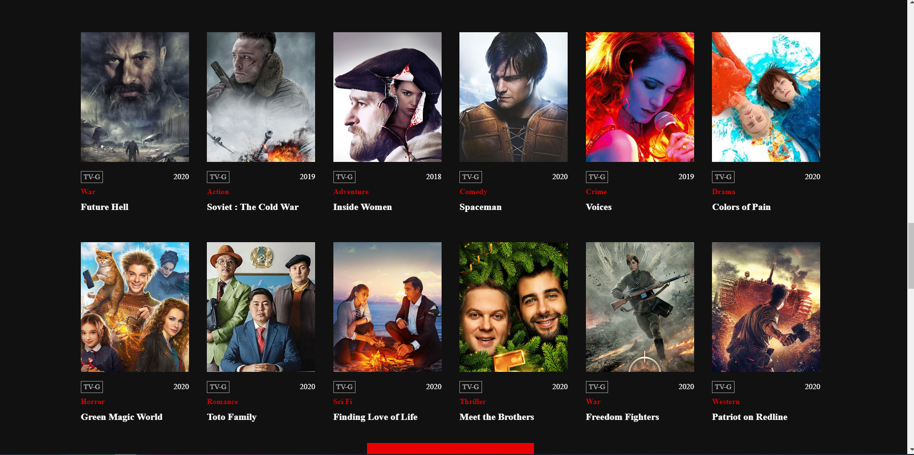
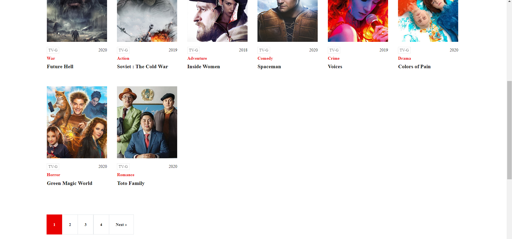

# Movie Streaming App

A Laravel-based movie streaming application featuring user authentication and a MySQL backend. This project allows users to browse and stream movies seamlessly.

## Features

- User authentication and registration
- Movie database with detailed descriptions
- Responsive design for mobile and desktop
- Admin panel for managing movies

## UI Screenshots

### Home Page


### Other pages







## Installation

1. Clone the repository:
   ```bash
   git clone https://github.com/webgeekhabib007/moviestreaminapp.git
   cd moviestreaminapp
